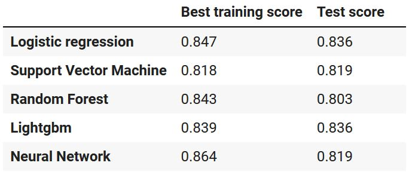
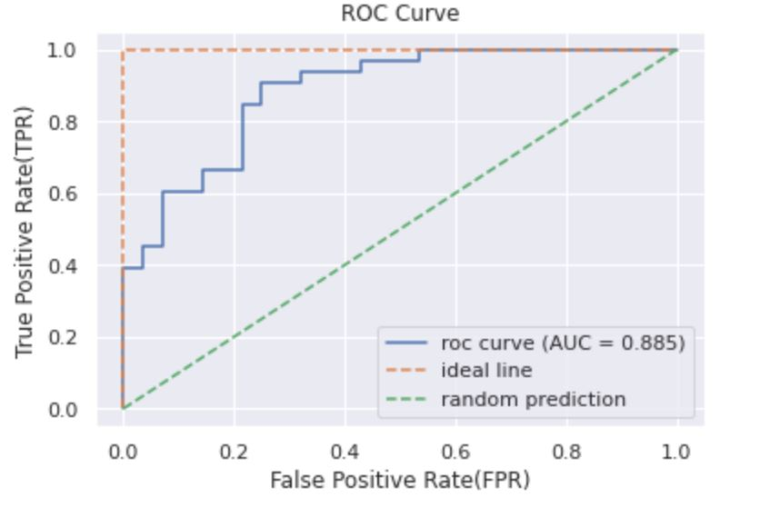
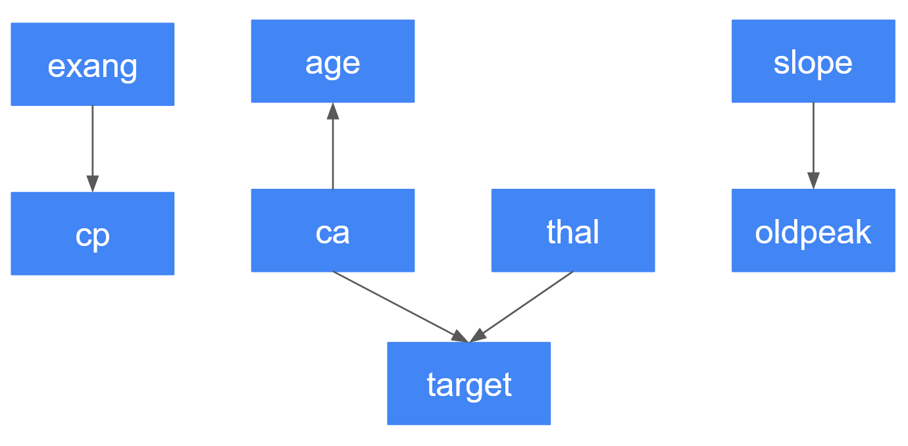

# Heart Attack Possibility

### Intro
Disease prediction helps you keep healthy. In addition, you can deal with your health problem more effectively before you get a diseases if you know what makes you sick. This project goes over creating heart attack prediction models. The causal relationships between variables will also be considered. The data is from ['Health care: Heart attack possibility' dataset in Kaggle](https://www.kaggle.com/nareshbhat/health-care-data-set-on-heart-attack-possibility).

---

### Dataset
This database contains 76 attributes, but all published experiments refer to using a subset of 14 of them. In particular, the Cleveland database is the only one that has been used by ML researchers to
this date.The "target" field refers to the presence of heart disease in the patient. It is integer valued 0 = no/less chance of heart attack and 1 = more chance of heart attack

Attribute Information
1) age
2) sex
3) chest pain type (values 0,1,2,3)
4) resting blood pressure
5) serum cholestorol in mg/dl
6) fasting blood sugar > 120 mg/dl
7) resting electrocardiographic results (values 0,1,2)
8) maximum heart rate achieved
9) exercise induced angina
10) oldpeak = ST depression induced by exercise relative to rest
11) the slope of the peak exercise ST segment
12) number of major vessels (0-3) colored by fluoroscopy
13) thal: 0 = normal; 1 = fixed defect; 2 = reversable defect
14) target: 0 = less chance of heart attack 1 = more chance of heart attack

Dataset is taken for learning purpose. Source of the data : https://archive.ics.uci.edu/ml/datasets/Heart+Disease

---

### Prediction Model
4 models were created (logistic regression, support vector machine, random forest, and lightgdb).

the lightgbm model was chosen for the best model because the difference between the training and the testing scores were relatively small and the testing score was also the highest.

The false positive rate is about 0.3 even if the true positive rate is about 0.9. This is still a good point of compromise to set the threshold if you would not like to miss many people who are actually likely to have a heart attack.

---

### Causal Estimation
Causal relationships between the variables were estimated using a bayesian network. A bayesian network is a probabilistic graphical model which is used for visualizing the causality between variables ([See this blog post](https://deepmind.com/blog/article/Causal_Bayesian_Networks)). The network is estiated using a PC algorithm, a test of independence (Chi-squared test). Here, a Python library called pgmpy was used to estimate a bayesian network.

Only 'ca' and 'thal' directed to 'target'. The important variables to predict 'target' might be 'ca' and 'thal'.

The ('ca' -> 'age') relationship appears to be a wrong causal connection. Generally speaking, 'ca' does not increase your age. It is assumed that when 'age' increases, 'ca' could also increase instead. Therefore, it could be considered that 'ca' and 'age' have an undirected connection ('ca' - 'age').

Bayesian network is helpful to visualize the causality but it might fail sometimes. It might also be useful to discover new causality.
